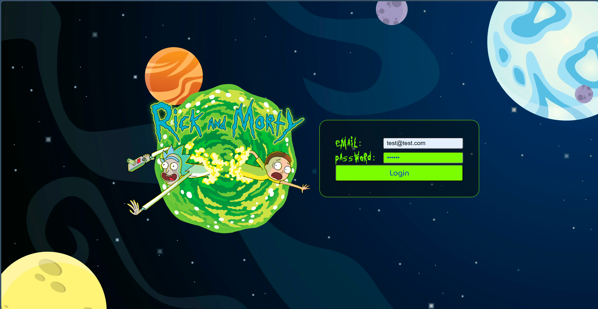
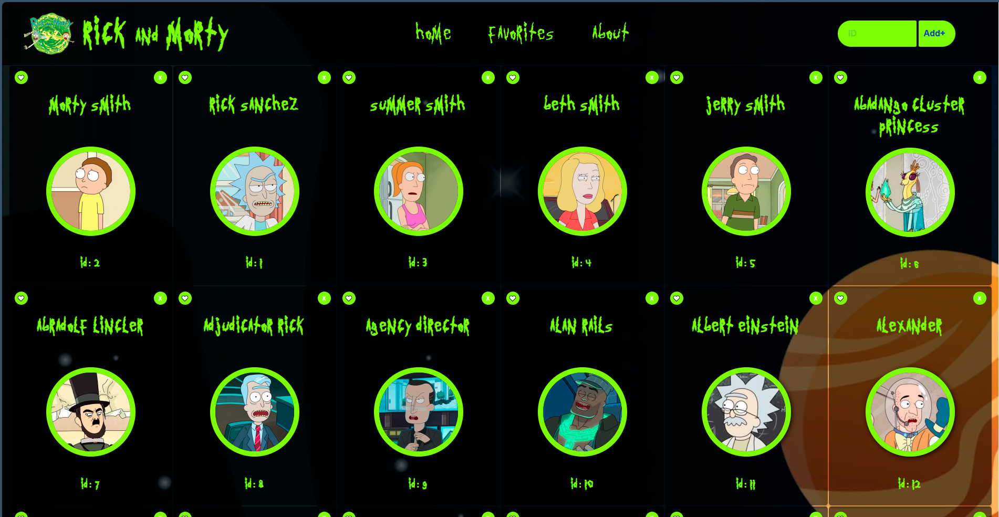
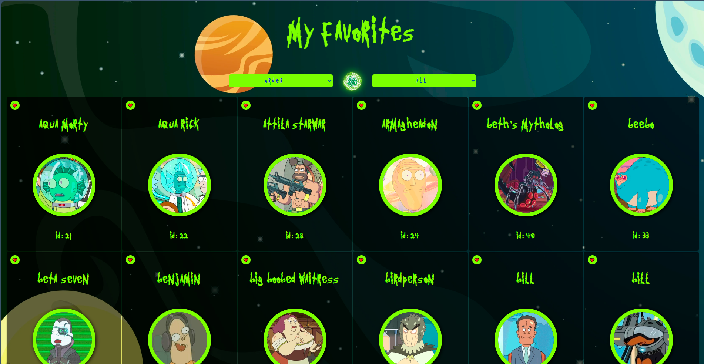

# **Rick & Morty SPA**  
Esta Single Page Application (SPA) te permitirá explorar el universo de Rick & Morty y sus personajes  
  

## Características Destacadas:

Conexión a la API de Rick & Morty: Esta SPA tiene acceso a la API de Rick & Morty, lo que te permite explorar una base de datos con más de 800 personajes de la serie.

Búsqueda Rápida: La barra de búsqueda te permite encontrar a tus personajes favoritos de manera rápida y sencilla. Solo necesitas ingresar su ID y voilà, podrás acceder a toda la información que necesitas.

Selección de Personajes Favoritos: ¿Tienes personajes favoritos que no quieres perder de vista? Estás de suerte, porque puedes seleccionar y guardar tus personajes favoritos en una sección especial.

## Tecnologías Utilizadas:

He aprovechado una variedad de tecnologías para hacer posible este proyecto. Entre las principales, se encuentran:

HTML, CSS y JS: La base de cualquier aplicación web, estas tecnologías se han utilizado para la estructura, el diseño y la funcionalidad de la SPA.

React y Redux: Utilizamos React y Redux para crear una interfaz de usuario dinámica y altamente interactiva.

Node.js y Express: En el lado del servidor, Node.js y Express se encargan de gestionar las solicitudes y respuestas, garantizando una experiencia fluida.

PostgreSQL: La base de datos PostgreSQL almacena los datos de tus personajes favoritos y las configuraciones de usuario.  

## Personajes:
  
 

## Favoritos:
  

---

Este proyecto es un testimonio de lo emocionante y poderoso que puede ser el desarrollo web cuando se combina con una de las series más queridas y extravagantes de la televisión. ¡Esperamos que disfrutes explorando el multiverso de Rick & Morty tanto como nosotros disfrutamos creándolo!  
